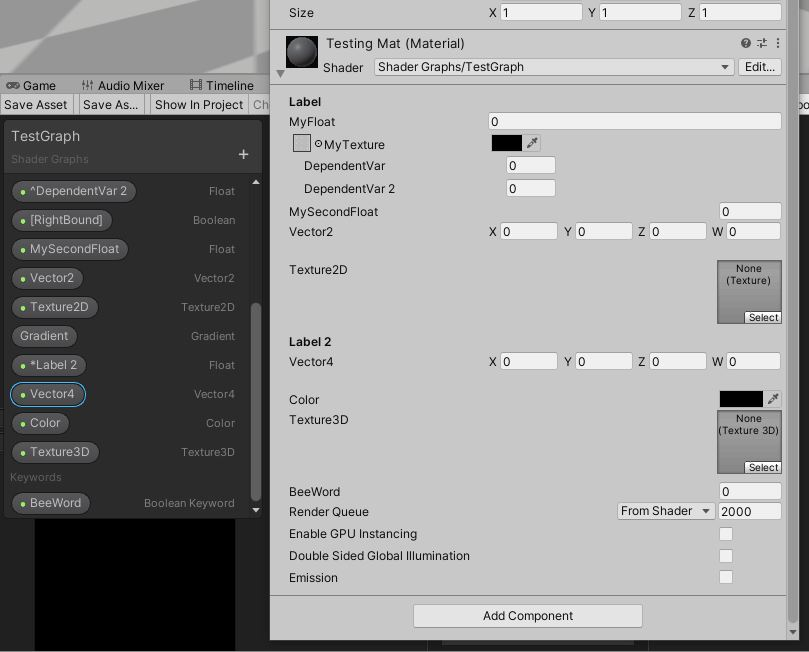
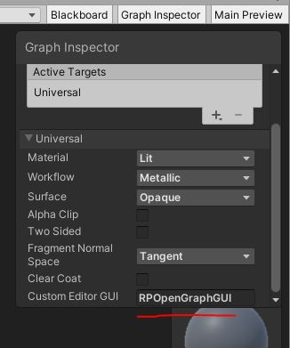
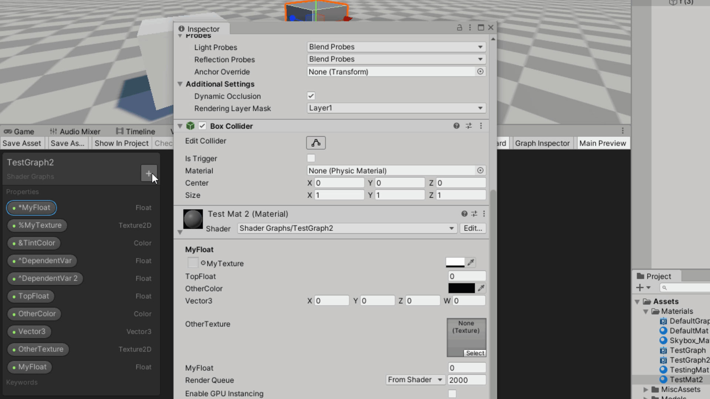

# OpenGraphGUI
An open-source Editor GUI for use with URP ShaderGraphs in Unity, aiming to clean up the look of Material Properties while providing ease-of-use via tagging.

### Custom GUI right from ShaderGraph


The default Inspector view for ShaderGraph-based materials can be somewhat bland at times, and often can't match the more streamlined look of the default Shaders provided by the Built-In renderer or other Render Pipelines. **OpenGraphGUI** opens up new options. 

## Why use OpenGraphGUI?

**OpenGraphGUI** lets you customize the appearance of your material properties right from ShaderGraph. Simply prefix your property names in the Shader's Blackboard with certain special characters, and any material using that Shader will display the custom GUI.



If you're looking for a more comprehensive and feature-complete Shader GUI package, I highly recommend [Shader Graph Markdown](https://assetstore.unity.com/packages/tools/gui/shader-graph-markdown-194781) which this project is inspired from. They will be able to provide much more support and QOL features for developers needing extensive custom GUIs. The intent of OpenGraphGUI is to provide a simple open source alternative that the community is free to edit and improve as needed. 

### Match the look of URP Lit Materials

**OpenGraphGUI** was built to be a replacement for the default ShaderGraph GUI provided by Unity. The feature set allows you to add in features such as the "Single Line Texture" that you'd find in default URP materials. It also provides labels and other "clean up" enhancements to give you more control over the look of your GUI. 

## Usage

In ShaderGraph, simply change your *"Custom Editor GUI"* setting to the named class *RPOpenGraphGUI*, and you're all set to start prefixing!



### Labels & Alignment

Prefix one of your properties with the star symbol (**\***) and that field will become a bold label.

Use a property called **\[Centered\]** to adjust the spacing of the Inspector fields to match the look of non-ShaderGraph default materials. Use a property called **\[RightBound\]** to return the field spacing to the default ShaderGraph look. 



### Property Rendering Features

Prefix a texture property with the percent symbol (**%**) and it will show as a single line texture property instead of the big thumbnail version. Single line textures are commonly used in the built-in materials and offer a cleaner look that takes up less space in your Inspector. 

Follow up a single-line texture property with an ampersand prefix (**&**) and the resulting property will be drawn on the same line as the texture. OpenGraphGUI calls this a "linked property", and you'll commonly find these used as "tint colors" in the default materials.

Follow up any texture property with an arrow prefix (**^**) and that property will only become visible when the texture above it has been filled out by the user (not null). This is called a "dependent visible" property. You'll find this on many custom shaders that utilize a strength value, appearing only when the asociated texture is present. 


### Extensions

**OpenGraphGUI** also supports custom property extensions if you'd like to keep the ease of use of prefixing without re-writing the whole package. 

To create a custom renderer for one of your properties, simply extend the *RPOpenGraphGUI* class with your own. In the constructor, initialize the "renderExtensions" dictionary like so:

```
public MyOpenGraphGUIExtension()
{
	//First initialize the property
	renderExtensions = new Dictionary<string, System.Action<MaterialEditor, MaterialProperty>>();
	//Then add in your custom render function,
	//with the key being the name of the property you want to override
	renderExtensions.Add("MyProperty", MyCustomRenderFunction);
}
```

Finally, set the *Custom Editor GUI* of your ShaderGraph to your custom class. That's it! Now you've got a custom function to render the property of your choice which is used in place of the drawing code that OpenGraphGUI would've used once it finds that property. 

## Installation

1. Open the [Package Manager](https://docs.unity3d.com/2020.3/Documentation/Manual/upm-ui.html) in Unity
2. Click the '+' icon and hit *"Add package from git URL"*
3. Add the GitHub "HTTPS Clone" URL for OpenGraphGUI: [https://github.com/RobProductions/OpenGraphGUI.git](https://github.com/RobProductions/OpenGraphGUI.git)
4. Wait for download to complete
5. Add the custom GUI class *RPOpenGraphGUI* to the *Custom Editor GUI* field in your ShaderGraph of choice

If installation fails due to version requirements, you may be able force OpenGraphGUI to work by downloading the project as .zip and editing the "package.json" file to lower the Unity requirement. Deleting the .meta files may also be necessary and shouldn't break anything... I think. Then use the *"Add package from disk"* option to add your custom version instead. 

If you're looking to add a specific release of OpenGraphGUI, you can specify a release tag with the hashtag like so: "https://github.com/RobProductions/OpenGraphGUI.git#ReleaseNumber"

## How to Contribute

This open source project is free for all to suggest improvements, and I'm hoping that more contributors could help clean up the code and add further features as suggested by the community. These are the recommended steps to add your contribution:

1. Fork the repository to your GitHub account
2. Create a new branch or work off of your own "working branch"
3. When your changes are complete, submit a pull request to merge your code; ideally to the "working-branch" used to test changes before main
4. If the PR is approved, aggregate changes will eventually be merged into main and a new release tag is created

## Credits & Details

Created by [RobProductions](https://twitter.com/RobProductions). RobProductions' Steam games can be found [here](https://store.steampowered.com/developer/robproductions).

### Requirements

- Tested with Unity 2020.3.26f1, though it will likely work in earlier versions too
- Tested in URP version 10.9, though it will likely work in earlier versions too

In theory **OpenGraphGUI** should work with regular Shaders and even HDRP ShaderGraphs too since it only requires looking at the display name of each property. This is useful because you can easily acquire the same clean look in your ShaderLab shaders by simply naming the properties in your shader file rather than writing a custom GUI to handle it. 

### Limitations

- Though there shouldn't be any performance concerns with the prefixing approach (Unity should automatically cull out properties internally that are not used), it does bloat up the ShaderGraph quite a bit. Since this is meant to be a simple enhancement, I didn't take the route of editing the ShaderGraph GUI itself, so prefixed properties won't look any different from non-prefixed ones.
- There are certain rules you must follow for your properties to show up as expected. All linked properties must follow a single line texture property. Dependent visible properties must follow another dependent visible or texture property or linked property (since it will be bundled with the texture). If those rules are violated, OpenGraphGUI will throw a warning to the console. 

### License

This work is licensed under the MIT License. The intent for this software is to expand the extend the functionality of ShaderGraph freely and openly, without requirement of attribution. The code may be considered "open source" and could include snippets from multiple collaborators. Contributors may be named in the README.md and Documentation files. 

The code is provided "as is" and without warranty. 