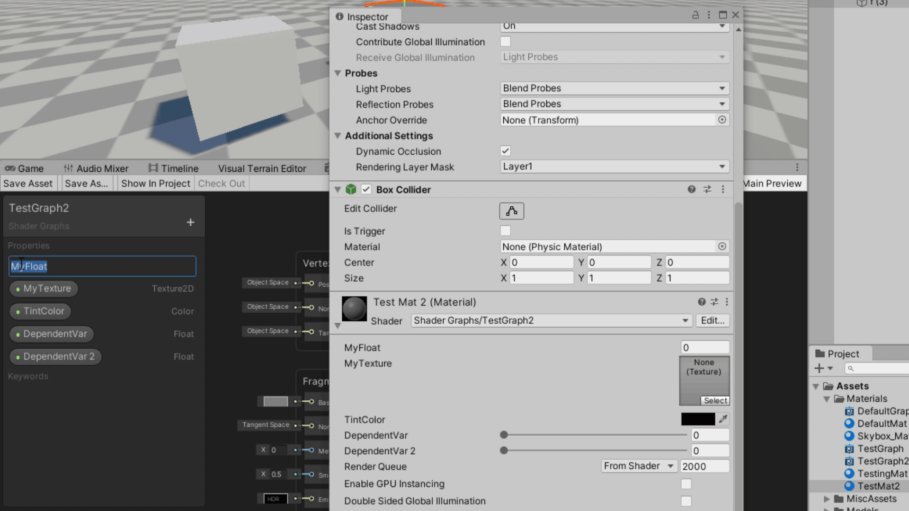

# OpenGraphGUI
An open-source Editor GUI for use with URP ShaderGraphs in Unity, aiming to clean up the look of Material Properties while providing ease-of-use via tagging.

### Custom GUI Right From ShaderGraph

The default Editor for ShaderGraph-based materials can be somewhat lackluster at times.

## Why use OpenGraphGUI?

**OpenGraphGUI** lets you 

### License

This work is licensed under the MIT License. The intent for this software is to expand the extend the functionality of ShaderGraph freely and openly, without requirement of attribution. 

The code is provided "as is" and without warranty. 